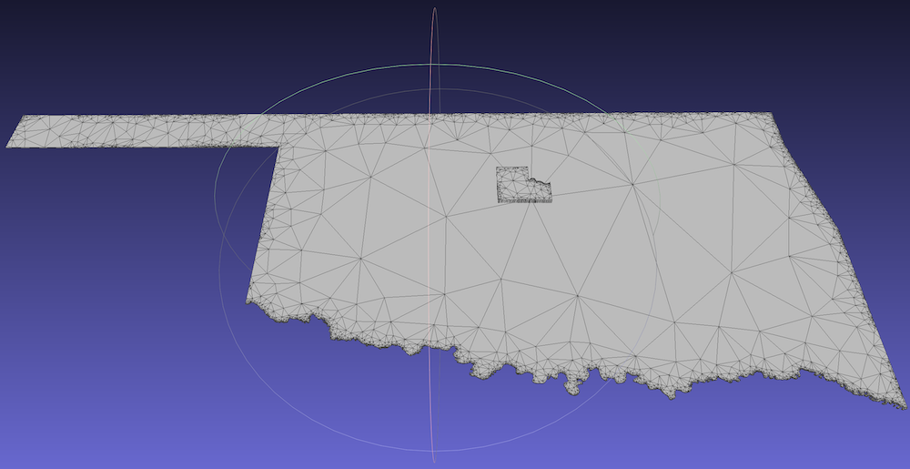

# ShapeExtrude

Simple Python utility to read in shape outlines in [Shapefile format](https://en.wikipedia.org/wiki/Shapefile) and extrude into a 3D model in [Wavefront.obj format](https://en.wikipedia.org/wiki/Wavefront_.obj_file).

## Prerequisites

This script requires Python3, and the ``shapefile`` (from ``pyshp``) and ``triangle`` modules. The ``matplotlib`` module can also be used to plot some basic visualizations where specified. These modules can be installed via, e.g.:

``pip3 install shapefile triangle matplotlib``

## Example 1

Running the script with no arguments prints a brief usage outline:

```
$ python3 main.py

Usage:
  python3 main.py SHAPEFile prefix [key=val] [delta z]

Where:
  SHAPEFile : path prefix to SHAPEFile data (don't include the file suffix!)
  key=val   : shape selector (if unspecified, list shapes in file then exit)
  delta z   : extrusion height on z axis (default: 1.0)

Example:
  python3 main.py my_data/my_shapefile blah=eek 0.25

  This looks for the shape in the my_data/my_shapefile.(dbf,shp,shx) file
  combination filtered using whichever record key "blah" has key "eek",
  and extrudes it into a 3d model of "height" 0.25 units. The output is
  written to an "output.obj" file.
```

Assuming the presence of the [Oklahoma Dept of Transport's county boundaries data set](https://www.odot.org/hqdiv/p-r-div/maps/shp-files/) in the subdirectory ``counties``, we may extract the boundary shape data for e.g. Logan county and extrude as follows:

```
python3 main.py county/COUNTY_BOUNDARY COUNTY_NAM=LOGAN 0.1
```

Here, we specify an extrusion length on the z-axis of ``0.1`` rather than the default ``1.0`` units. Note that the key,val data is case sensitive; using ``county_nam=logan`` rather than ``COUNTY_NAM=LOGAN`` will not work. This command results on the following output:

```
$ python3 main.py county/COUNTY_BOUNDARY LOGAN 0.1

77 shapes total. Fields:
   ('DeletionFlag', 'C', 1, 0)
   ['COUNTY_FIP', 'N', 10, 0]
   ['COUNTY_NO', 'N', 10, 0]
   ['MAINTENANC', 'N', 10, 0]
   ['COUNTY_NAM', 'C', 13, 0]
   ['ADT_FACTOR', 'F', 24, 5]
   ['MAIN_DISTR', 'N', 10, 0]
   ['PHONE_NO_B', 'C', 14, 0]
   ['DESC_LOCAT', 'C', 80, 0]
   ['MSLINK', 'F', 24, 5]
   ['MAPID', 'F', 24, 5]
   ['LOGIN', 'C', 8, 0]
   ['CREATION_D', 'D', 8, 0]
   ['CNTY_SEAT_', 'N', 10, 0]
   ['MUNICIPAL_', 'F', 24, 5]

Simplifying shapes with min_dr = 1e-06:
      0 :     1    232 =>     1    232
      1 :     1    634 =>     1    633
      2 :     1    580 =>     1    579
      3 :     1    390 =>     1    389
      4 :     1    458 =>     1    458
      5 :     1    638 =>     1    638
      6 :     1    699 =>     1    699
      7 :     1     84 =>     1     83
      8 :     1    142 =>     1    141
      9 :     1    223 =>     1    223
     10 :     1    243 =>     1    231
     11 :     1   5263 =>     1   5261
     12 :     1    312 =>     1    300
     13 :     1    271 =>     1    271
     14 :     1   2980 =>     1   2978
     15 :     1    493 =>     1    491
     16 :     1    241 =>     1    240
     17 :     1    307 =>     1    305
     18 :     1    744 =>     1    743
     19 :     1   1529 =>     1   1529
     20 :     1    497 =>     1    496
     21 :     1    411 =>     1    409
     22 :     1   1219 =>     1   1219
     23 :     1    995 =>     1    994
     24 :     1   3029 =>     1   3025
     25 :     1    289 =>     1    289
     26 :     1   1983 =>     1   1982
     27 :     1    698 =>     1    698
     28 :     1    257 =>     1    257
     29 :     1   1264 =>     1   1263
     30 :     1    661 =>     1    659
     31 :     1    677 =>     1    675
     32 :     1    612 =>     1    612
     33 :     1    148 =>     1    148
     34 :     1   1131 =>     1   1127
     35 :     1    568 =>     1    568
     36 :     1    269 =>     1    269
     37 :     1   1733 =>     1   1729
     38 :     1    569 =>     1    568
     39 :     1    615 =>     1    615
     40 :     1    573 =>     1    573
     41 :     1    360 =>     1    360
     42 :     1    969 =>     1    969
     43 :     1    101 =>     1    101
     44 :     1    142 =>     1    141
     45 :     1     98 =>     1     97
     46 :     1    143 =>     1    143
     47 :     1    265 =>     1    265
     48 :     1    314 =>     1    314
     49 :     1    153 =>     1    153
     50 :     1    764 =>     1    764
     51 :     1    448 =>     1    448
     52 :     1   2246 =>     1   2246
     53 :     1    494 =>     1    493
     54 :     1    185 =>     1    185
     55 :     1    634 =>     1    633
     56 :     1    179 =>     1    179
     57 :     1    152 =>     1    152
     58 :     1    420 =>     1    419
     59 :     1    129 =>     1    128
     60 :     1    115 =>     1    115
     61 :     1    932 =>     1    932
     62 :     1    133 =>     1    132
     63 :     1    159 =>     1    158
     64 :     1    198 =>     1    196
     65 :     1    114 =>     1    114
     66 :     1    657 =>     1    656
     67 :     1    112 =>     1    112
     68 :     1    153 =>     1    153
     69 :     1    115 =>     1    114
     70 :     1    998 =>     1    996
     71 :     1    236 =>     1    236
     72 :     1    405 =>     1    403
     73 :     1    169 =>     1    169
     74 :     1    627 =>     1    627
     75 :     1     86 =>     1     86
     76 :     1   1525 =>     1   1524

LOGAN (21): 1 parts, 409 points
408 input vtx; 793 output vtx; 1127 output tri
```

As can be seen in the output above, the shape outlines have been simplified slightly. This is useful as duplicate points in the shape definition (as can be common in such data) can crash ``triangle``'s mesh generation routines.

To simply list some information about the shapes present in the file, we may omit the shape name:

```
$ python3 main.py county/COUNTY_BOUNDARY

77 shapes total. Fields:
   ('DeletionFlag', 'C', 1, 0)
   ['COUNTY_FIP', 'N', 10, 0]
   ['COUNTY_NO', 'N', 10, 0]
   ['MAINTENANC', 'N', 10, 0]
   ['COUNTY_NAM', 'C', 13, 0]
   ['ADT_FACTOR', 'F', 24, 5]
   ['MAIN_DISTR', 'N', 10, 0]
   ['PHONE_NO_B', 'C', 14, 0]
   ['DESC_LOCAT', 'C', 80, 0]
   ['MSLINK', 'F', 24, 5]
   ['MAPID', 'F', 24, 5]
   ['LOGIN', 'C', 8, 0]
   ['CREATION_D', 'D', 8, 0]
   ['CNTY_SEAT_', 'N', 10, 0]
   ['MUNICIPAL_', 'F', 24, 5]

Simplifying shapes with min_dr = 1e-06:
      0 :     1    232 =>     1    232
      1 :     1    634 =>     1    633
      2 :     1    580 =>     1    579
      3 :     1    390 =>     1    389
      4 :     1    458 =>     1    458
      5 :     1    638 =>     1    638
      6 :     1    699 =>     1    699
      7 :     1     84 =>     1     83
      8 :     1    142 =>     1    141
      9 :     1    223 =>     1    223
     10 :     1    243 =>     1    231
     11 :     1   5263 =>     1   5261
     12 :     1    312 =>     1    300
     13 :     1    271 =>     1    271
     14 :     1   2980 =>     1   2978
     15 :     1    493 =>     1    491
     16 :     1    241 =>     1    240
     17 :     1    307 =>     1    305
     18 :     1    744 =>     1    743
     19 :     1   1529 =>     1   1529
     20 :     1    497 =>     1    496
     21 :     1    411 =>     1    409
     22 :     1   1219 =>     1   1219
     23 :     1    995 =>     1    994
     24 :     1   3029 =>     1   3025
     25 :     1    289 =>     1    289
     26 :     1   1983 =>     1   1982
     27 :     1    698 =>     1    698
     28 :     1    257 =>     1    257
     29 :     1   1264 =>     1   1263
     30 :     1    661 =>     1    659
     31 :     1    677 =>     1    675
     32 :     1    612 =>     1    612
     33 :     1    148 =>     1    148
     34 :     1   1131 =>     1   1127
     35 :     1    568 =>     1    568
     36 :     1    269 =>     1    269
     37 :     1   1733 =>     1   1729
     38 :     1    569 =>     1    568
     39 :     1    615 =>     1    615
     40 :     1    573 =>     1    573
     41 :     1    360 =>     1    360
     42 :     1    969 =>     1    969
     43 :     1    101 =>     1    101
     44 :     1    142 =>     1    141
     45 :     1     98 =>     1     97
     46 :     1    143 =>     1    143
     47 :     1    265 =>     1    265
     48 :     1    314 =>     1    314
     49 :     1    153 =>     1    153
     50 :     1    764 =>     1    764
     51 :     1    448 =>     1    448
     52 :     1   2246 =>     1   2246
     53 :     1    494 =>     1    493
     54 :     1    185 =>     1    185
     55 :     1    634 =>     1    633
     56 :     1    179 =>     1    179
     57 :     1    152 =>     1    152
     58 :     1    420 =>     1    419
     59 :     1    129 =>     1    128
     60 :     1    115 =>     1    115
     61 :     1    932 =>     1    932
     62 :     1    133 =>     1    132
     63 :     1    159 =>     1    158
     64 :     1    198 =>     1    196
     65 :     1    114 =>     1    114
     66 :     1    657 =>     1    656
     67 :     1    112 =>     1    112
     68 :     1    153 =>     1    153
     69 :     1    115 =>     1    114
     70 :     1    998 =>     1    996
     71 :     1    236 =>     1    236
     72 :     1    405 =>     1    403
     73 :     1    169 =>     1    169
     74 :     1    627 =>     1    627
     75 :     1     86 =>     1     86
     76 :     1   1525 =>     1   1524

COUNTY_FIP=35 COUNTY_NO=18 MAINTENANC=8 COUNTY_NAM=CRAIG ADT_FACTOR=1.02 MAIN_DISTR=2520 PHONE_NO_B= DESC_LOCAT= MSLINK=18.0 MAPID=101431.0 LOGIN=upln038 CREATION_D=1999-07-23 CNTY_SEAT_=2520 MUNICIPAL_=77550.0
COUNTY_FIP=45 COUNTY_NO=23 MAINTENANC=6 COUNTY_NAM=ELLIS ADT_FACTOR=1.01 MAIN_DISTR=2190 PHONE_NO_B= DESC_LOCAT= MSLINK=23.0 MAPID=101436.0 LOGIN=upln038 CREATION_D=1999-07-23 CNTY_SEAT_=110 MUNICIPAL_=2800.0
COUNTY_FIP=49 COUNTY_NO=25 MAINTENANC=3 COUNTY_NAM=GARVIN ADT_FACTOR=1.01 MAIN_DISTR=1875 PHONE_NO_B=(405) 238-2739 DESC_LOCAT= MSLINK=25.0 MAPID=101438.0 LOGIN=upln038 CREATION_D=1999-07-23 CNTY_SEAT_=1875 MUNICIPAL_=57550.0
COUNTY_FIP=51 COUNTY_NO=26 MAINTENANC=7 COUNTY_NAM=GRADY ADT_FACTOR=1.02 MAIN_DISTR=485 PHONE_NO_B= DESC_LOCAT= MSLINK=26.0 MAPID=101439.0 LOGIN=upln038 CREATION_D=1999-07-23 CNTY_SEAT_=485 MUNICIPAL_=13950.0
COUNTY_FIP=59 COUNTY_NO=30 MAINTENANC=6 COUNTY_NAM=HARPER ADT_FACTOR=1.01 MAIN_DISTR=310 PHONE_NO_B= DESC_LOCAT= MSLINK=30.0 MAPID=101443.0 LOGIN=upln038 CREATION_D=1999-07-23 CNTY_SEAT_=310 MUNICIPAL_=9850.0
COUNTY_FIP=61 COUNTY_NO=31 MAINTENANC=1 COUNTY_NAM=HASKELL ADT_FACTOR=1.01 MAIN_DISTR=2295 PHONE_NO_B=(918) 967-2049 DESC_LOCAT= MSLINK=31.0 MAPID=101444.0 LOGIN=upln038 CREATION_D=1999-07-23 CNTY_SEAT_=2295 MUNICIPAL_=70250.0
COUNTY_FIP=27 COUNTY_NO=14 MAINTENANC=3 COUNTY_NAM=CLEVELAND ADT_FACTOR=1.03 MAIN_DISTR=1755 PHONE_NO_B=(405) 321-8308 DESC_LOCAT= MSLINK=14.0 MAPID=101427.0 LOGIN=upln038 CREATION_D=1999-07-23 CNTY_SEAT_=1755 MUNICIPAL_=52500.0
COUNTY_FIP=29 COUNTY_NO=15 MAINTENANC=3 COUNTY_NAM=COAL ADT_FACTOR=1.02 MAIN_DISTR=525 PHONE_NO_B=(405) 927-2530 DESC_LOCAT= MSLINK=15.0 MAPID=101428.0 LOGIN=upln038 CREATION_D=1999-07-23 CNTY_SEAT_=525 MUNICIPAL_=15800.0
COUNTY_FIP=31 COUNTY_NO=16 MAINTENANC=7 COUNTY_NAM=COMANCHE ADT_FACTOR=1.02 MAIN_DISTR=1405 PHONE_NO_B= DESC_LOCAT= MSLINK=16.0 MAPID=101429.0 LOGIN=upln038 CREATION_D=1999-07-23 CNTY_SEAT_=1405 MUNICIPAL_=41850.0
COUNTY_FIP=9 COUNTY_NO=5 MAINTENANC=5 COUNTY_NAM=BECKHAM ADT_FACTOR=1.01 MAIN_DISTR=2150 PHONE_NO_B=(405) 928-3120 DESC_LOCAT= MSLINK=103.0 MAPID=101418.0 LOGIN=upln038 CREATION_D=1999-07-23 CNTY_SEAT_=2150 MUNICIPAL_=65700.0
COUNTY_FIP=11 COUNTY_NO=6 MAINTENANC=5 COUNTY_NAM=BLAINE ADT_FACTOR=1.02 MAIN_DISTR=2580 PHONE_NO_B=(405) 623-4344 DESC_LOCAT= MSLINK=101.0 MAPID=101419.0 LOGIN=upln038 CREATION_D=1999-07-23 CNTY_SEAT_=2580 MUNICIPAL_=78950.0
COUNTY_FIP=13 COUNTY_NO=7 MAINTENANC=2 COUNTY_NAM=BRYAN ADT_FACTOR=1.02 MAIN_DISTR=730 PHONE_NO_B=(405) 924-2871 DESC_LOCAT= MSLINK=104.0 MAPID=101421.0 LOGIN=upln038 CREATION_D=1999-07-23 CNTY_SEAT_=730 MUNICIPAL_=22050.0
COUNTY_FIP=15 COUNTY_NO=8 MAINTENANC=7 COUNTY_NAM=CADDO ADT_FACTOR=1.01 MAIN_DISTR=80 PHONE_NO_B= DESC_LOCAT= MSLINK=100.0 MAPID=101422.0 LOGIN=upln038 CREATION_D=1999-07-23 CNTY_SEAT_=80 MUNICIPAL_=2050.0
COUNTY_FIP=19 COUNTY_NO=10 MAINTENANC=7 COUNTY_NAM=CARTER ADT_FACTOR=1.02 MAIN_DISTR=100 PHONE_NO_B= DESC_LOCAT= MSLINK=10.0 MAPID=101420.0 LOGIN=upln038 CREATION_D=1999-07-23 CNTY_SEAT_=100 MUNICIPAL_=2600.0
COUNTY_FIP=23 COUNTY_NO=12 MAINTENANC=2 COUNTY_NAM=CHOCTAW ADT_FACTOR=1.02 MAIN_DISTR=1190 PHONE_NO_B=(405) 326-6656 DESC_LOCAT= MSLINK=12.0 MAPID=101425.0 LOGIN=upln038 CREATION_D=1999-07-23 CNTY_SEAT_=1190 MUNICIPAL_=36300.0
COUNTY_FIP=33 COUNTY_NO=17 MAINTENANC=7 COUNTY_NAM=COTTON ADT_FACTOR=1.01 MAIN_DISTR=2540 PHONE_NO_B= DESC_LOCAT= MSLINK=17.0 MAPID=101430.0 LOGIN=upln038 CREATION_D=1999-07-23 CNTY_SEAT_=2540 MUNICIPAL_=78150.0
COUNTY_FIP=21 COUNTY_NO=11 MAINTENANC=1 COUNTY_NAM=CHEROKEE ADT_FACTOR=1.02 MAIN_DISTR=2525 PHONE_NO_B=(918) 456-3622 DESC_LOCAT= MSLINK=11.0 MAPID=101424.0 LOGIN=upln038 CREATION_D=1999-07-23 CNTY_SEAT_=2370 MUNICIPAL_=72100.0
COUNTY_FIP=63 COUNTY_NO=32 MAINTENANC=3 COUNTY_NAM=HUGHES ADT_FACTOR=1.01 MAIN_DISTR=1160 PHONE_NO_B=(405) 379-5897 DESC_LOCAT= MSLINK=32.0 MAPID=101445.0 LOGIN=upln038 CREATION_D=1999-07-23 CNTY_SEAT_=1160 MUNICIPAL_=35400.0
COUNTY_FIP=69 COUNTY_NO=35 MAINTENANC=3 COUNTY_NAM=JOHNSTON ADT_FACTOR=1.01 MAIN_DISTR=2445 PHONE_NO_B=(405) 371-2639 DESC_LOCAT= MSLINK=35.0 MAPID=101448.0 LOGIN=upln038 CREATION_D=1999-07-23 CNTY_SEAT_=2445 MUNICIPAL_=73900.0
COUNTY_FIP=75 COUNTY_NO=38 MAINTENANC=5 COUNTY_NAM=KIOWA ADT_FACTOR=1.01 MAIN_DISTR=1150 PHONE_NO_B=(405) 726-3518 DESC_LOCAT= MSLINK=38.0 MAPID=101451.0 LOGIN=upln038 CREATION_D=1999-07-23 CNTY_SEAT_=1150 MUNICIPAL_=35000.0
COUNTY_FIP=79 COUNTY_NO=40 MAINTENANC=2 COUNTY_NAM=LEFLORE ADT_FACTOR=1.02 MAIN_DISTR=1955 PHONE_NO_B=(918) 647-3737 DESC_LOCAT= MSLINK=40.0 MAPID=101453.0 LOGIN=upln038 CREATION_D=1999-07-23 CNTY_SEAT_=1955 MUNICIPAL_=60350.0
COUNTY_FIP=83 COUNTY_NO=42 MAINTENANC=4 COUNTY_NAM=LOGAN ADT_FACTOR=1.02 MAIN_DISTR=1020 PHONE_NO_B=(405) 282-3863 DESC_LOCAT= MSLINK=42.0 MAPID=101455.0 LOGIN=upln038 CREATION_D=1999-07-23 CNTY_SEAT_=1020 MUNICIPAL_=31700.0
COUNTY_FIP=85 COUNTY_NO=43 MAINTENANC=7 COUNTY_NAM=LOVE ADT_FACTOR=1.01 MAIN_DISTR=1560 PHONE_NO_B= DESC_LOCAT= MSLINK=43.0 MAPID=101456.0 LOGIN=upln038 CREATION_D=1999-07-23 CNTY_SEAT_=1560 MUNICIPAL_=46500.0
COUNTY_FIP=87 COUNTY_NO=44 MAINTENANC=3 COUNTY_NAM=MCCLAIN ADT_FACTOR=1.03 MAIN_DISTR=1975 PHONE_NO_B=(405) 527-2045 DESC_LOCAT= MSLINK=44.0 MAPID=101457.0 LOGIN=upln038 CREATION_D=1999-07-23 CNTY_SEAT_=1975 MUNICIPAL_=61150.0
COUNTY_FIP=89 COUNTY_NO=45 MAINTENANC=2 COUNTY_NAM=MCCURTAIN ADT_FACTOR=1.01 MAIN_DISTR=1205 PHONE_NO_B=(405) 286-2524 DESC_LOCAT= MSLINK=45.0 MAPID=101458.0 LOGIN=upln038 CREATION_D=1999-07-23 CNTY_SEAT_=1205 MUNICIPAL_=36750.0
COUNTY_FIP=93 COUNTY_NO=47 MAINTENANC=6 COUNTY_NAM=MAJOR ADT_FACTOR=1.01 MAIN_DISTR=820 PHONE_NO_B= DESC_LOCAT= MSLINK=47.0 MAPID=101460.0 LOGIN=upln038 CREATION_D=1999-07-23 CNTY_SEAT_=820 MUNICIPAL_=25100.0
COUNTY_FIP=95 COUNTY_NO=48 MAINTENANC=2 COUNTY_NAM=MARSHALL ADT_FACTOR=1.01 MAIN_DISTR=1520 PHONE_NO_B=(405) 795-2617 DESC_LOCAT= MSLINK=48.0 MAPID=101461.0 LOGIN=upln038 CREATION_D=1999-07-23 CNTY_SEAT_=1520 MUNICIPAL_=45750.0
COUNTY_FIP=99 COUNTY_NO=50 MAINTENANC=7 COUNTY_NAM=MURRAY ADT_FACTOR=1.01 MAIN_DISTR=645 PHONE_NO_B= DESC_LOCAT= MSLINK=50.0 MAPID=101463.0 LOGIN=upln038 CREATION_D=1999-07-23 CNTY_SEAT_=2350 MUNICIPAL_=71350.0
COUNTY_FIP=103 COUNTY_NO=52 MAINTENANC=4 COUNTY_NAM=NOBLE ADT_FACTOR=1.01 MAIN_DISTR=1910 PHONE_NO_B=(405) 336-2203 DESC_LOCAT= MSLINK=52.0 MAPID=101465.0 LOGIN=upln038 CREATION_D=1999-07-23 CNTY_SEAT_=1910 MUNICIPAL_=58250.0
COUNTY_FIP=113 COUNTY_NO=57 MAINTENANC=8 COUNTY_NAM=OSAGE ADT_FACTOR=1.02 MAIN_DISTR=1880 PHONE_NO_B= DESC_LOCAT= MSLINK=57.0 MAPID=101471.0 LOGIN=upln038 CREATION_D=1999-07-23 CNTY_SEAT_=1880 MUNICIPAL_=57600.0
COUNTY_FIP=117 COUNTY_NO=59 MAINTENANC=8 COUNTY_NAM=PAWNEE ADT_FACTOR=1.01 MAIN_DISTR=1885 PHONE_NO_B= DESC_LOCAT= MSLINK=59.0 MAPID=101473.0 LOGIN=upln038 CREATION_D=1999-07-23 CNTY_SEAT_=1885 MUNICIPAL_=57650.0
COUNTY_FIP=121 COUNTY_NO=61 MAINTENANC=2 COUNTY_NAM=PITTSBURG ADT_FACTOR=1.02 MAIN_DISTR=1490 PHONE_NO_B=(918) 423-5769 DESC_LOCAT= MSLINK=61.0 MAPID=101475.0 LOGIN=upln038 CREATION_D=1999-07-23 CNTY_SEAT_=1490 MUNICIPAL_=44800.0
COUNTY_FIP=123 COUNTY_NO=62 MAINTENANC=3 COUNTY_NAM=PONTOTOC ADT_FACTOR=1.02 MAIN_DISTR=10 PHONE_NO_B=(405) 332-1526 DESC_LOCAT= MSLINK=3.0 MAPID=101476.0 LOGIN=upln038 CREATION_D=1999-07-23 CNTY_SEAT_=10 MUNICIPAL_=200.0
COUNTY_FIP=39 COUNTY_NO=20 MAINTENANC=5 COUNTY_NAM=CUSTER ADT_FACTOR=1.01 MAIN_DISTR=95 PHONE_NO_B=(405) 323-1036 DESC_LOCAT= MSLINK=20.0 MAPID=101433.0 LOGIN=upln038 CREATION_D=1999-07-23 CNTY_SEAT_=95 MUNICIPAL_=2500.0
COUNTY_FIP=125 COUNTY_NO=63 MAINTENANC=3 COUNTY_NAM=POTTAWATOMIE ADT_FACTOR=1.02 MAIN_DISTR=2395 PHONE_NO_B=(405) 598-5896 DESC_LOCAT= MSLINK=63.0 MAPID=101477.0 LOGIN=upln038 CREATION_D=1999-07-23 CNTY_SEAT_=2195 MUNICIPAL_=66800.0
COUNTY_FIP=129 COUNTY_NO=65 MAINTENANC=5 COUNTY_NAM=ROGER MILLS ADT_FACTOR=1.01 MAIN_DISTR=480 PHONE_NO_B=(405) 497-3388 DESC_LOCAT= MSLINK=65.0 MAPID=101479.0 LOGIN=upln038 CREATION_D=1999-07-23 CNTY_SEAT_=480 MUNICIPAL_=13900.0
COUNTY_FIP=131 COUNTY_NO=66 MAINTENANC=8 COUNTY_NAM=ROGERS ADT_FACTOR=1.03 MAIN_DISTR=500 PHONE_NO_B= DESC_LOCAT= MSLINK=66.0 MAPID=101480.0 LOGIN=upln038 CREATION_D=1999-07-23 CNTY_SEAT_=500 MUNICIPAL_=14700.0
COUNTY_FIP=133 COUNTY_NO=67 MAINTENANC=3 COUNTY_NAM=SEMINOLE ADT_FACTOR=1.01 MAIN_DISTR=2650 PHONE_NO_B=(405) 257-2109 DESC_LOCAT= MSLINK=67.0 MAPID=101481.0 LOGIN=upln038 CREATION_D=1999-07-23 CNTY_SEAT_=2650 MUNICIPAL_=80550.0
COUNTY_FIP=145 COUNTY_NO=73 MAINTENANC=1 COUNTY_NAM=WAGONER ADT_FACTOR=1.03 MAIN_DISTR=2370 PHONE_NO_B=(918) 485-3797 DESC_LOCAT= MSLINK=73.0 MAPID=101487.0 LOGIN=upln038 CREATION_D=1999-07-23 CNTY_SEAT_=2525 MUNICIPAL_=77850.0
COUNTY_FIP=149 COUNTY_NO=75 MAINTENANC=5 COUNTY_NAM=WASHITA ADT_FACTOR=1.01 MAIN_DISTR=1730 PHONE_NO_B=(405) 832-2735 DESC_LOCAT= MSLINK=75.0 MAPID=101489.0 LOGIN=upln038 CREATION_D=1999-07-23 CNTY_SEAT_=1730 MUNICIPAL_=17200.0
COUNTY_FIP=153 COUNTY_NO=77 MAINTENANC=6 COUNTY_NAM=WOODWARD ADT_FACTOR=1.02 MAIN_DISTR=2685 PHONE_NO_B= DESC_LOCAT= MSLINK=7.0 MAPID=101491.0 LOGIN=upln038 CREATION_D=1999-07-23 CNTY_SEAT_=2685 MUNICIPAL_=82150.0
COUNTY_FIP=17 COUNTY_NO=9 MAINTENANC=4 COUNTY_NAM=CANADIAN ADT_FACTOR=1.03 MAIN_DISTR=785 PHONE_NO_B=(405) 262-0212 DESC_LOCAT= MSLINK=9.0 MAPID=101423.0 LOGIN=upln038 CREATION_D=1999-07-23 CNTY_SEAT_=785 MUNICIPAL_=23700.0
COUNTY_FIP=67 COUNTY_NO=34 MAINTENANC=7 COUNTY_NAM=JEFFERSON ADT_FACTOR=1.01 MAIN_DISTR=2595 PHONE_NO_B= DESC_LOCAT= MSLINK=34.0 MAPID=101447.0 LOGIN=upln038 CREATION_D=1999-07-23 CNTY_SEAT_=2595 MUNICIPAL_=79250.0
COUNTY_FIP=1 COUNTY_NO=1 MAINTENANC=1 COUNTY_NAM=ADAIR ADT_FACTOR=1.02 MAIN_DISTR=2305 PHONE_NO_B=(918) 696-2930 DESC_LOCAT= MSLINK=1.0 MAPID=101414.0 LOGIN=upln038 CREATION_D=1999-07-23 CNTY_SEAT_=2305 MUNICIPAL_=70350.0
COUNTY_FIP=3 COUNTY_NO=2 MAINTENANC=6 COUNTY_NAM=ALFALFA ADT_FACTOR=1.01 MAIN_DISTR=475 PHONE_NO_B= DESC_LOCAT= MSLINK=8.0 MAPID=101415.0 LOGIN=upln038 CREATION_D=1999-07-23 CNTY_SEAT_=475 MUNICIPAL_=13750.0
COUNTY_FIP=5 COUNTY_NO=3 MAINTENANC=2 COUNTY_NAM=ATOKA ADT_FACTOR=1.02 MAIN_DISTR=125 PHONE_NO_B=(405) 889-2117 DESC_LOCAT= MSLINK=102.0 MAPID=101416.0 LOGIN=upln038 CREATION_D=1999-07-23 CNTY_SEAT_=125 MUNICIPAL_=3300.0
COUNTY_FIP=41 COUNTY_NO=21 MAINTENANC=8 COUNTY_NAM=DELAWARE ADT_FACTOR=1.02 MAIN_DISTR=1230 PHONE_NO_B= DESC_LOCAT= MSLINK=21.0 MAPID=101434.0 LOGIN=upln038 CREATION_D=1999-07-23 CNTY_SEAT_=1230 MUNICIPAL_=37650.0
COUNTY_FIP=7 COUNTY_NO=4 MAINTENANC=6 COUNTY_NAM=BEAVER ADT_FACTOR=1.01 MAIN_DISTR=150 PHONE_NO_B= DESC_LOCAT= MSLINK=6.0 MAPID=101417.0 LOGIN=upln038 CREATION_D=1999-07-23 CNTY_SEAT_=150 MUNICIPAL_=4750.0
COUNTY_FIP=25 COUNTY_NO=13 MAINTENANC=6 COUNTY_NAM=CIMARRON ADT_FACTOR=1.01 MAIN_DISTR=225 PHONE_NO_B= DESC_LOCAT= MSLINK=4.0 MAPID=101426.0 LOGIN=upln038 CREATION_D=1999-07-23 CNTY_SEAT_=225 MUNICIPAL_=7300.0
COUNTY_FIP=53 COUNTY_NO=27 MAINTENANC=4 COUNTY_NAM=GRANT ADT_FACTOR=1.01 MAIN_DISTR=1600 PHONE_NO_B=(405) 395-2359 DESC_LOCAT= MSLINK=27.0 MAPID=101440.0 LOGIN=upln038 CREATION_D=1999-07-23 CNTY_SEAT_=1600 MUNICIPAL_=47300.0
COUNTY_FIP=55 COUNTY_NO=28 MAINTENANC=5 COUNTY_NAM=GREER ADT_FACTOR=1.01 MAIN_DISTR=1530 PHONE_NO_B=(405) 782-3645 DESC_LOCAT= MSLINK=28.0 MAPID=101441.0 LOGIN=upln038 CREATION_D=1999-07-23 CNTY_SEAT_=1530 MUNICIPAL_=46050.0
COUNTY_FIP=57 COUNTY_NO=29 MAINTENANC=5 COUNTY_NAM=HARMON ADT_FACTOR=1.01 MAIN_DISTR=1165 PHONE_NO_B=(405) 688-2600 DESC_LOCAT= MSLINK=29.0 MAPID=101442.0 LOGIN=upln038 CREATION_D=1999-07-23 CNTY_SEAT_=1165 MUNICIPAL_=35500.0
COUNTY_FIP=65 COUNTY_NO=33 MAINTENANC=5 COUNTY_NAM=JACKSON ADT_FACTOR=1.02 MAIN_DISTR=60 PHONE_NO_B=(405) 482-7658 DESC_LOCAT= MSLINK=33.0 MAPID=101446.0 LOGIN=upln038 CREATION_D=1999-07-23 CNTY_SEAT_=60 MUNICIPAL_=1700.0
COUNTY_FIP=71 COUNTY_NO=36 MAINTENANC=4 COUNTY_NAM=KAY ADT_FACTOR=1.02 MAIN_DISTR=205 PHONE_NO_B=(405) 363-3817 DESC_LOCAT= MSLINK=36.0 MAPID=101449.0 LOGIN=upln038 CREATION_D=1999-07-23 CNTY_SEAT_=1735 MUNICIPAL_=51300.0
COUNTY_FIP=81 COUNTY_NO=41 MAINTENANC=3 COUNTY_NAM=LINCOLN ADT_FACTOR=1.02 MAIN_DISTR=455 PHONE_NO_B=(405) 258-0494 DESC_LOCAT= MSLINK=41.0 MAPID=101454.0 LOGIN=upln038 CREATION_D=1999-07-23 CNTY_SEAT_=455 MUNICIPAL_=13500.0
COUNTY_FIP=91 COUNTY_NO=46 MAINTENANC=1 COUNTY_NAM=MCINTOSH ADT_FACTOR=1.01 MAIN_DISTR=800 PHONE_NO_B=(918) 689-3301 DESC_LOCAT= MSLINK=46.0 MAPID=101459.0 LOGIN=upln038 CREATION_D=1999-07-23 CNTY_SEAT_=800 MUNICIPAL_=24650.0
COUNTY_FIP=37 COUNTY_NO=19 MAINTENANC=8 COUNTY_NAM=CREEK ADT_FACTOR=1.02 MAIN_DISTR=285 PHONE_NO_B= DESC_LOCAT= MSLINK=19.0 MAPID=101432.0 LOGIN=upln038 CREATION_D=1999-07-23 CNTY_SEAT_=2135 MUNICIPAL_=65400.0
COUNTY_FIP=43 COUNTY_NO=22 MAINTENANC=5 COUNTY_NAM=DEWEY ADT_FACTOR=1.01 MAIN_DISTR=2385 PHONE_NO_B=(405) 328-5416 DESC_LOCAT= MSLINK=22.0 MAPID=101435.0 LOGIN=upln038 CREATION_D=1999-07-23 CNTY_SEAT_=2385 MUNICIPAL_=72350.0
COUNTY_FIP=139 COUNTY_NO=70 MAINTENANC=6 COUNTY_NAM=TEXAS ADT_FACTOR=1.01 MAIN_DISTR=1025 PHONE_NO_B= DESC_LOCAT= MSLINK=5.0 MAPID=101484.0 LOGIN=upln038 CREATION_D=1999-07-23 CNTY_SEAT_=1025 MUNICIPAL_=31750.0
COUNTY_FIP=73 COUNTY_NO=37 MAINTENANC=4 COUNTY_NAM=KINGFISHER ADT_FACTOR=1.01 MAIN_DISTR=1325 PHONE_NO_B=(405) 375-3250 DESC_LOCAT= MSLINK=37.0 MAPID=101450.0 LOGIN=upln038 CREATION_D=1999-07-23 CNTY_SEAT_=1325 MUNICIPAL_=39850.0
COUNTY_FIP=77 COUNTY_NO=39 MAINTENANC=2 COUNTY_NAM=LATIMER ADT_FACTOR=1.01 MAIN_DISTR=2655 PHONE_NO_B=(918) 465-2212 DESC_LOCAT= MSLINK=39.0 MAPID=101452.0 LOGIN=upln038 CREATION_D=1999-07-23 CNTY_SEAT_=2655 MUNICIPAL_=81000.0
COUNTY_FIP=107 COUNTY_NO=54 MAINTENANC=3 COUNTY_NAM=OKFUSKEE ADT_FACTOR=1.01 MAIN_DISTR=1810 PHONE_NO_B=(918) 623-1538 DESC_LOCAT= MSLINK=54.0 MAPID=101467.0 LOGIN=upln038 CREATION_D=1999-07-23 CNTY_SEAT_=1810 MUNICIPAL_=54200.0
COUNTY_FIP=111 COUNTY_NO=56 MAINTENANC=1 COUNTY_NAM=OKMULGEE ADT_FACTOR=1.01 MAIN_DISTR=1820 PHONE_NO_B=(918) 756-1454 DESC_LOCAT= MSLINK=56.0 MAPID=101470.0 LOGIN=upln038 CREATION_D=1999-07-23 CNTY_SEAT_=1820 MUNICIPAL_=55150.0
COUNTY_FIP=109 COUNTY_NO=55 MAINTENANC=4 COUNTY_NAM=OKLAHOMA ADT_FACTOR=1.03 MAIN_DISTR=755 PHONE_NO_B=(405) 522-0881 DESC_LOCAT= MSLINK=55.0 MAPID=101469.0 LOGIN=upln038 CREATION_D=1999-07-23 CNTY_SEAT_=1815 MUNICIPAL_=55000.0
COUNTY_FIP=143 COUNTY_NO=72 MAINTENANC=8 COUNTY_NAM=TULSA ADT_FACTOR=1.03 MAIN_DISTR=2465 PHONE_NO_B= DESC_LOCAT= MSLINK=72.0 MAPID=101486.0 LOGIN=upln038 CREATION_D=1999-07-23 CNTY_SEAT_=2465 MUNICIPAL_=75000.0
COUNTY_FIP=97 COUNTY_NO=49 MAINTENANC=8 COUNTY_NAM=MAYES ADT_FACTOR=1.02 MAIN_DISTR=1970 PHONE_NO_B= DESC_LOCAT= MSLINK=49.0 MAPID=101462.0 LOGIN=upln038 CREATION_D=1999-07-23 CNTY_SEAT_=1970 MUNICIPAL_=61000.0
COUNTY_FIP=101 COUNTY_NO=51 MAINTENANC=1 COUNTY_NAM=MUSKOGEE ADT_FACTOR=1.02 MAIN_DISTR=1700 PHONE_NO_B=(918) 687-5407 DESC_LOCAT= MSLINK=51.0 MAPID=101464.0 LOGIN=upln038 CREATION_D=1999-07-23 CNTY_SEAT_=1700 MUNICIPAL_=50050.0
COUNTY_FIP=105 COUNTY_NO=53 MAINTENANC=8 COUNTY_NAM=NOWATA ADT_FACTOR=1.01 MAIN_DISTR=1770 PHONE_NO_B= DESC_LOCAT= MSLINK=53.0 MAPID=101466.0 LOGIN=upln038 CREATION_D=1999-07-23 CNTY_SEAT_=1770 MUNICIPAL_=52900.0
COUNTY_FIP=47 COUNTY_NO=24 MAINTENANC=4 COUNTY_NAM=GARFIELD ADT_FACTOR=1.02 MAIN_DISTR=790 PHONE_NO_B=(405) 234-6149 DESC_LOCAT= MSLINK=24.0 MAPID=101437.0 LOGIN=upln038 CREATION_D=1999-07-23 CNTY_SEAT_=790 MUNICIPAL_=23950.0
COUNTY_FIP=147 COUNTY_NO=74 MAINTENANC=8 COUNTY_NAM=WASHINGTON ADT_FACTOR=1.02 MAIN_DISTR=145 PHONE_NO_B= DESC_LOCAT= MSLINK=74.0 MAPID=101488.0 LOGIN=upln038 CREATION_D=1999-07-23 CNTY_SEAT_=145 MUNICIPAL_=4450.0
COUNTY_FIP=151 COUNTY_NO=76 MAINTENANC=6 COUNTY_NAM=WOODS ADT_FACTOR=1.01 MAIN_DISTR=65 PHONE_NO_B= DESC_LOCAT= MSLINK=76.0 MAPID=101490.0 LOGIN=upln038 CREATION_D=1999-07-23 CNTY_SEAT_=65 MUNICIPAL_=1800.0
COUNTY_FIP=115 COUNTY_NO=58 MAINTENANC=8 COUNTY_NAM=OTTAWA ADT_FACTOR=1.01 MAIN_DISTR=1620 PHONE_NO_B= DESC_LOCAT= MSLINK=58.0 MAPID=101472.0 LOGIN=upln038 CREATION_D=1999-07-23 CNTY_SEAT_=1620 MUNICIPAL_=48000.0
COUNTY_FIP=119 COUNTY_NO=60 MAINTENANC=4 COUNTY_NAM=PAYNE ADT_FACTOR=1.01 MAIN_DISTR=615 PHONE_NO_B=(918) 225-3777 DESC_LOCAT= MSLINK=60.0 MAPID=101474.0 LOGIN=upln038 CREATION_D=1999-07-23 CNTY_SEAT_=2300 MUNICIPAL_=70300.0
COUNTY_FIP=127 COUNTY_NO=64 MAINTENANC=2 COUNTY_NAM=PUSHMATAHA ADT_FACTOR=1.01 MAIN_DISTR=85 PHONE_NO_B=(405) 298-3371 DESC_LOCAT= MSLINK=64.0 MAPID=101478.0 LOGIN=upln038 CREATION_D=1999-07-23 CNTY_SEAT_=85 MUNICIPAL_=2250.0
COUNTY_FIP=135 COUNTY_NO=68 MAINTENANC=1 COUNTY_NAM=SEQUOYAH ADT_FACTOR=1.02 MAIN_DISTR=2120 PHONE_NO_B=(918) 775-4668 DESC_LOCAT= MSLINK=68.0 MAPID=101482.0 LOGIN=upln038 CREATION_D=1999-07-23 CNTY_SEAT_=2120 MUNICIPAL_=65000.0
COUNTY_FIP=137 COUNTY_NO=69 MAINTENANC=7 COUNTY_NAM=STEPHENS ADT_FACTOR=1.02 MAIN_DISTR=725 PHONE_NO_B= DESC_LOCAT= MSLINK=69.0 MAPID=101483.0 LOGIN=upln038 CREATION_D=1999-07-23 CNTY_SEAT_=725 MUNICIPAL_=21900.0
COUNTY_FIP=141 COUNTY_NO=71 MAINTENANC=5 COUNTY_NAM=TILLMAN ADT_FACTOR=1.01 MAIN_DISTR=895 PHONE_NO_B=(405) 335-5218 DESC_LOCAT= MSLINK=71.0 MAPID=101485.0 LOGIN=upln038 CREATION_D=1999-07-23 CNTY_SEAT_=895 MUNICIPAL_=27800.0
```

## Example 2

Assuming the presence of the U.S. Census [state boundary shapefiles](https://www.census.gov/geographies/mapping-files/time-series/geo/carto-boundary-file.html) in the subdirectory ``cb_2018_us_state_500k``, and the Oklahoma Dept. of Transport's [county boundaries shapefiles](https://www.odot.org/hqdiv/p-r-div/maps/shp-files/) in the subdirectory ``counties``, we can superpose e.g. a 3D model of Logan county onto a slightly thinner 3D model of the state of Oklahoma:

First, a 3D model of the state of Oklahoma is generated using the keyval filter ``NAME=Oklahoma`` with a width of 0.01 units:

```
$ python3 main.py cb_2018_us_state_500k/cb_2018_us_state_500k NAME=Oklahoma 0.01

56 shapes total. Fields:
   ('DeletionFlag', 'C', 1, 0)
   ['STATEFP', 'C', 2, 0]
   ['STATENS', 'C', 8, 0]
   ['AFFGEOID', 'C', 11, 0]
   ['GEOID', 'C', 2, 0]
   ['STUSPS', 'C', 2, 0]
   ['NAME', 'C', 100, 0]
   ['LSAD', 'C', 2, 0]
   ['ALAND', 'N', 14, 0]
   ['AWATER', 'N', 14, 0]

Simplifying shapes with min_dr = 1e-06:
      0 :     8   2849 =>     8   2849
      1 :    13   5500 =>    13   5493
      2 :     1   2642 =>     1   2642
      3 :    11   5989 =>    11   5987
      4 :     1   3880 =>     1   3876
      5 :    46   5606 =>    46   5605
      6 :   111  13734 =>   111  13726
      7 :    33   2579 =>    33   2579
      8 :     1   3261 =>     1   3261
      9 :   116   7866 =>   116   7863
     10 :     1   1978 =>     1   1975
     11 :    58   6890 =>    58   6887
     12 :     1    696 =>     1    696
     13 :    14   2414 =>    14   2413
     14 :     1   1751 =>     1   1748
     15 :    31  12959 =>    31  12956
     16 :    13   5077 =>    13   5073
     17 :     7   1909 =>     7   1906
     18 :     2   3034 =>     2   3030
     19 :     1   1813 =>     1   1813
     20 :     1   3025 =>     1   3024
     21 :     1    500 =>     1    500
     22 :     1    433 =>     1    433
     23 :     1   2269 =>     1   2267
     24 :     1    427 =>     1    427
     25 :    18   4209 =>    18   4203
     26 :     1   1488 =>     1   1485
     27 :   588 116646 =>   588 116638
     28 :     1    753 =>     1    753
     29 :     1   3098 =>     1   3096
     30 :     1   1634 =>     1   1634
     31 :     1   2626 =>     1   2626
     32 :     1   2639 =>     1   2639
     33 :     4   2704 =>     4   2703
     34 :     4   1849 =>     4   1849
     35 :     1   1414 =>     1   1414
     36 :     1    217 =>     1    216
     37 :     9   1017 =>     9   1017
     38 :    22   2874 =>    22   2869
     39 :     1   1564 =>     1   1563
     40 :    18   7474 =>    18   7472
     41 :   207   7348 =>   207   7347
     42 :    28   2683 =>    28   2683
     43 :     4    535 =>     4    535
     44 :     3    660 =>     3    659
     45 :    17   2000 =>    17   2000
     46 :    13   1242 =>    13   1242
     47 :     2   3154 =>     2   3153
     48 :    12   3197 =>    12   3191
     49 :    27   5363 =>    27   5359
     50 :     8   2107 =>     8   2107
     51 :     1   3217 =>     1   3216
     52 :     1   2486 =>     1   2486
     53 :     1   2190 =>     1   2187
     54 :     5   6042 =>     5   6040
     55 :    10   1046 =>    10   1046

2641 input vtx; 6646 output vtx; 9670 output tri
```

We should now rename the output file (``output.obj``) to prevent the following command overwriting it!

Next, we generate a 3D model of Logan county using the keyval filter ``COUNTY_NAM=LOGAN`` with a width of 0.1 units:

```
$ python3 main.py county/COUNTY_BOUNDARY COUNTY_NAM=LOGAN 0.1

77 shapes total. Fields:
   ('DeletionFlag', 'C', 1, 0)
   ['COUNTY_FIP', 'N', 10, 0]
   ['COUNTY_NO', 'N', 10, 0]
   ['MAINTENANC', 'N', 10, 0]
   ['COUNTY_NAM', 'C', 13, 0]
   ['ADT_FACTOR', 'F', 24, 5]
   ['MAIN_DISTR', 'N', 10, 0]
   ['PHONE_NO_B', 'C', 14, 0]
   ['DESC_LOCAT', 'C', 80, 0]
   ['MSLINK', 'F', 24, 5]
   ['MAPID', 'F', 24, 5]
   ['LOGIN', 'C', 8, 0]
   ['CREATION_D', 'D', 8, 0]
   ['CNTY_SEAT_', 'N', 10, 0]
   ['MUNICIPAL_', 'F', 24, 5]

Simplifying shapes with min_dr = 1e-06:
      0 :     1    232 =>     1    232
      1 :     1    634 =>     1    633
      2 :     1    580 =>     1    579
      3 :     1    390 =>     1    389
      4 :     1    458 =>     1    458
      5 :     1    638 =>     1    638
      6 :     1    699 =>     1    699
      7 :     1     84 =>     1     83
      8 :     1    142 =>     1    141
      9 :     1    223 =>     1    223
     10 :     1    243 =>     1    231
     11 :     1   5263 =>     1   5261
     12 :     1    312 =>     1    300
     13 :     1    271 =>     1    271
     14 :     1   2980 =>     1   2978
     15 :     1    493 =>     1    491
     16 :     1    241 =>     1    240
     17 :     1    307 =>     1    305
     18 :     1    744 =>     1    743
     19 :     1   1529 =>     1   1529
     20 :     1    497 =>     1    496
     21 :     1    411 =>     1    409
     22 :     1   1219 =>     1   1219
     23 :     1    995 =>     1    994
     24 :     1   3029 =>     1   3025
     25 :     1    289 =>     1    289
     26 :     1   1983 =>     1   1982
     27 :     1    698 =>     1    698
     28 :     1    257 =>     1    257
     29 :     1   1264 =>     1   1263
     30 :     1    661 =>     1    659
     31 :     1    677 =>     1    675
     32 :     1    612 =>     1    612
     33 :     1    148 =>     1    148
     34 :     1   1131 =>     1   1127
     35 :     1    568 =>     1    568
     36 :     1    269 =>     1    269
     37 :     1   1733 =>     1   1729
     38 :     1    569 =>     1    568
     39 :     1    615 =>     1    615
     40 :     1    573 =>     1    573
     41 :     1    360 =>     1    360
     42 :     1    969 =>     1    969
     43 :     1    101 =>     1    101
     44 :     1    142 =>     1    141
     45 :     1     98 =>     1     97
     46 :     1    143 =>     1    143
     47 :     1    265 =>     1    265
     48 :     1    314 =>     1    314
     49 :     1    153 =>     1    153
     50 :     1    764 =>     1    764
     51 :     1    448 =>     1    448
     52 :     1   2246 =>     1   2246
     53 :     1    494 =>     1    493
     54 :     1    185 =>     1    185
     55 :     1    634 =>     1    633
     56 :     1    179 =>     1    179
     57 :     1    152 =>     1    152
     58 :     1    420 =>     1    419
     59 :     1    129 =>     1    128
     60 :     1    115 =>     1    115
     61 :     1    932 =>     1    932
     62 :     1    133 =>     1    132
     63 :     1    159 =>     1    158
     64 :     1    198 =>     1    196
     65 :     1    114 =>     1    114
     66 :     1    657 =>     1    656
     67 :     1    112 =>     1    112
     68 :     1    153 =>     1    153
     69 :     1    115 =>     1    114
     70 :     1    998 =>     1    996
     71 :     1    236 =>     1    236
     72 :     1    405 =>     1    403
     73 :     1    169 =>     1    169
     74 :     1    627 =>     1    627
     75 :     1     86 =>     1     86
     76 :     1   1525 =>     1   1524

408 input vtx; 793 output vtx; 1127 output tri
```

When visualized in [MeshLab](https://www.meshlab.net), these models look like this:

